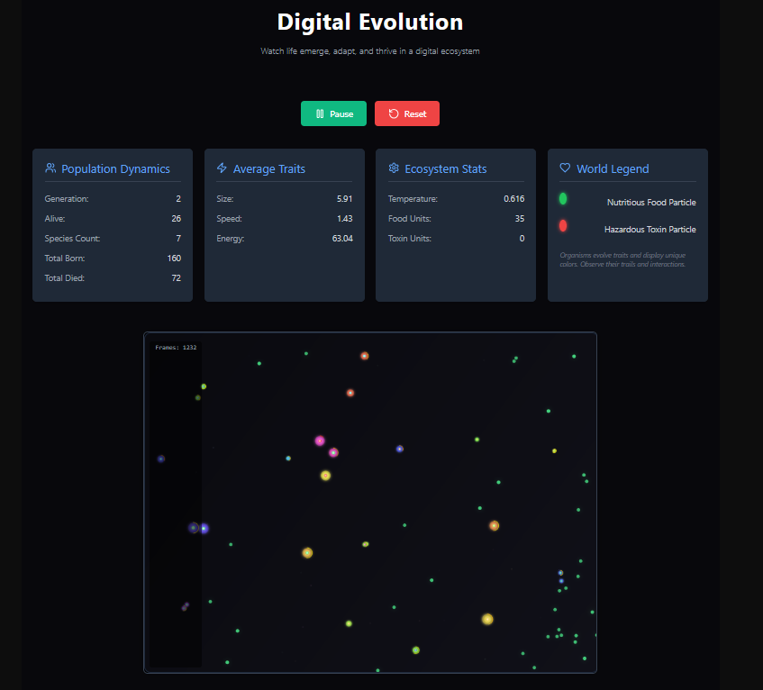

# Digital Evolution: A React-Based Artificial Life Simulator



An interactive artificial life simulation built with React, where digital organisms evolve, adapt, and compete in a dynamic environment. Witness the principles of natural selection and emergent behavior unfold in real-time on an HTML5 canvas.

## Table of Contents

1.  [Overview](#overview)
2.  [Features](#features)
3.  [How It Works](#how-it-works)
    *   [Organisms & Genomes](#organisms--genomes)
    *   [Environment](#environment)
    *   [The Evolution Cycle](#the-evolution-cycle)
    *   [Visualization](#visualization)
4.  [Technologies Used](#technologies-used)
5.  [Getting Started](#getting-started)
    *   [Prerequisites](#prerequisites)
    *   [Installation](#installation)
    *   [Running the Simulation](#running-the-simulation)
6.  [Simulation Parameters (`SIM_PARAMS`)](#simulation-parameters-sim_params)
7.  [Understanding the UI](#understanding-the-ui)
8.  [Future Enhancements (Ideas)](#future-enhancements-ideas)
9.  [Contributing](#contributing)

## Overview

This project simulates a digital ecosystem where simple organisms live, consume food, avoid toxins, reproduce, and evolve over generations. Each organism possesses a unique genome that dictates its traits, such as size, speed, energy efficiency, sensor range, and more. Through mutation and natural selection, populations adapt to the ever-changing environment, sometimes leading to the emergence of distinct species and complex behaviors.

The simulation is built as a single React component, leveraging the HTML5 Canvas API for rendering and `lucide-react` for UI icons.

## Features

*   **Dynamic Evolution:** Watch organisms evolve traits over generations based on survival and reproductive success.
*   **Complex Genomes:** Organisms have a rich set of genetic traits including:
    *   Size, speed, energy efficiency
    *   Reproduction threshold and speed
    *   Lifespan, toxin resistance, sensor range
    *   Behavioral traits like aggressiveness and sociability
    *   Visual appearance (hue)
*   **Environmental Factors:** The world includes:
    *   Food particles (replenish energy)
    *   Toxin particles (damage organisms)
    *   Fluctuating temperature (induces stress)
    *   Limited food abundance
*   **Reproduction & Variation:**
    *   Organisms reproduce (asexually or sexually with nearby mates of the same species).
    *   Offspring inherit traits with a chance of mutation, introducing new variations.
*   **Interactive Visualization:**
    *   Organisms rendered with unique colors, sizes, and trails.
    *   Food and toxin particles are distinctly visualized.
    *   Dynamic background particles for aesthetic appeal.
*   **Real-time Statistics:** UI panels display:
    *   Population dynamics (count, generation, born/died)
    *   Average evolved traits (size, speed, energy)
    *   Ecosystem status (temperature, food/toxin counts)
*   **User Controls:**
    *   Play/Pause the simulation.
    *   Reset the simulation to its initial state.
*   **Emergent Behaviors:** Potential for complex patterns like flocking, niche specialization, or predator-prey dynamics (rudimentary) to arise from simple rules.
*   **Species Differentiation:** A simple species calculation based on genome influences mating and some behaviors.

## How It Works

The simulation operates in discrete time steps, updating the state of each organism and the environment.

### Organisms & Genomes

The core of the simulation is the `Organism` class. Each instance has:
*   **Position & Velocity:** For movement on the 2D canvas.
*   **Energy:** Consumed over time (metabolism, movement, stress) and gained from food. Death occurs if energy drops to zero.
*   **Age & Lifespan:** Organisms die of old age if their lifespan is exceeded.
*   **Genome:** A set of genes defining its characteristics. Initial organisms have randomized genomes within predefined ranges. Offspring inherit and mutate these genomes.
    *   `size`, `speed`, `energyEfficiencyFactor`, `reproductionThresholdFactor`, `reproductionSpeedFactor`, `lifespan`, `aggressiveness`, `sociability`, `toxinResistance`, `sensorRange`, `hue`.
*   **Behavior (`behave` method):**
    *   Senses nearby food, toxins, and other organisms within its `sensorRange`.
    *   Moves towards food if energy is low or below reproductive threshold.
    *   Moves away from toxins.
    *   May exhibit social behavior (move towards same species) or aggressive behavior (move towards/away from different species based on relative size/energy).
    *   Random movement if no other strong stimuli.
*   **Reproduction (`reproduce` method):**
    *   Can reproduce if energy is above `reproductionThreshold`, age is sufficient, and reproduction cooldown has passed.
    *   Reproduction costs energy.
    *   If a suitable mate (same species, nearby) is found, crossover occurs, mixing parental genomes. Otherwise, asexual reproduction (cloning with mutation).
    *   The child's genome is mutated based on `MUTATION_RATE`.

### Environment

Managed by `environmentRef`, it contains:
*   **Food:** Particles that organisms can consume for energy. Spawned periodically based on `foodAbundance`.
*   **Toxins:** Particles that damage organisms unless they have sufficient `toxinResistance`. Spawned periodically based on `toxicity`.
*   **Temperature:** Fluctuates sinusoidally over time, creating stress if it deviates from `TEMPERATURE_OPTIMUM`.
*   **Canvas Dimensions:** Defines the world boundaries (organisms wrap around).
*   **Particles:** Aesthetic background particles.

### The Evolution Cycle

Managed by `simulationStep` and `animate`:
1.  **Update Environment:** Time advances, temperature changes, new food/toxins may spawn, old ones despawn.
2.  **Organism Update:**
    *   Age and reproduction cooldown are updated.
    *   Metabolic energy cost is deducted, influenced by size, energy efficiency, and environmental stress (temperature, toxins).
    *   `behave()` method is called to determine movement.
    *   Position is updated based on velocity; velocity has damping.
    *   Organisms wrap around canvas edges.
3.  **Interactions:**
    *   **Eating:** Organisms consume food they are close enough to.
    *   **Reproduction:** Eligible organisms reproduce, creating new organisms.
4.  **Culling:** Dead organisms (zero energy or past lifespan) are removed.
5.  **Statistics Update:** Average traits, population counts, etc., are recalculated.
6.  **Rendering:** The `animate` function calls `draw` methods for organisms, food, toxins, and background particles on the canvas.
7.  The cycle repeats via `requestAnimationFrame` if the simulation is running.

### Visualization

*   Organisms are drawn as circles, with color (hue) determined by their genome.
*   Their size reflects their `genome.size`.
*   A "species indicator" (a smaller inner circle) is drawn, with its color based on the organism's calculated species.
*   An energy bar is drawn around organisms if their energy is below a certain threshold.
*   Organisms leave a fading trail.
*   Food particles are green, toxins are red.

## Technologies Used

*   **React 18+** (functional components, Hooks: `useState`, `useEffect`, `useRef`, `useCallback`)
*   **JavaScript (ES6+)**
*   **HTML5 Canvas API** for 2D rendering
*   **Lucide React** for icons
*   Inline CSS (via `<style>` tag) for component styling

## Getting Started

### Prerequisites

*   Node.js (e.g., v16 or newer)
*   npm or yarn

### Installation

1.  **Clone the repository (or download the code):**
    ```bash
    git clone <repository-url>
    cd <repository-folder-name>
    ```

2.  **Install dependencies:**
    ```bash
    npm install
    # or
    yarn install
    ```

### Running the Simulation

1.  **Start the development server:**
    ```bash
    npm start
    # or
    yarn start
    ```
2.  Open your browser and navigate to `http://localhost:3000` (or the port specified in your terminal).

You should see the "Digital Evolution" interface. Click "Evolve" to start the simulation.

## Simulation Parameters (`SIM_PARAMS`)

The core behavior of the simulation is heavily influenced by constants defined in the `SIM_PARAMS` object at the top of the `EvolutionSimulation.js` file. These include:

*   `ORGANISM_MAX_ENERGY`: Maximum energy an organism can store.
*   `CHILD_INITIAL_ENERGY`: Energy a newborn organism starts with.
*   `REPRODUCTION_THRESHOLD_FACTOR_MIN/MAX`: Multiplier for max energy to determine reproduction energy threshold.
*   `MUTATION_RATE`: Probability of a gene mutating during reproduction.
*   `FOOD_ENERGY_GAIN`: Energy gained from consuming one food particle.
*   `LIFESPAN_BASE` & `LIFESPAN_RANDOM_ADD`: Define organism lifespan.
*   `METABOLIC_RATE_BASE`: Base energy cost per tick.
*   ...and many more controlling various aspects of organism traits, costs, and environmental effects.

Experimenting with these values can drastically change the evolutionary trajectories and emergent behaviors.

## Understanding the UI

The interface provides controls and real-time information:

*   **Controls:**
    *   **Evolve/Pause Button:** Starts or pauses the simulation.
    *   **Reset Button:** Stops the simulation and reinitializes it with a new starting population.
*   **Statistics Cards:**
    *   **Population Dynamics:** Shows current generation, number of living organisms, distinct species count, and total born/died.
    *   **Average Traits:** Displays the population-wide average for size, speed, and energy.
    *   **Ecosystem Stats:** Current environmental temperature, and counts of food and toxin units.
    *   **World Legend:** Explains the visual representation of food and toxin particles.
*   **Canvas Area:** The main view where organisms, food, and toxins are rendered.
    *   An "Extinction Event" message appears if all organisms die.
    *   A frame counter (`Frames`) is displayed at the bottom-left.
*   **Information Section ("Understanding Digital Evolution"):** Provides a brief textual explanation of the simulation's core concepts (Genetic Blueprint, Survival of the Fittest, etc.).

## Future Enhancements (Ideas)

*   **UI Controls for `SIM_PARAMS`:** Allow users to tweak key simulation parameters directly from the UI.
*   **Graphing Stats Over Time:** Plot average traits, population size, etc., to visualize evolutionary trends.
*   **More Complex Behaviors:**
    *   True predation (organisms hunting other organisms).
    *   More sophisticated herding/flocking.
    *   Cooperative behaviors.
*   **Diverse Food Sources:** Different types of food with varying energy values or effects.
*   **Obstacles/Terrain:** Introduce static obstacles in the environment.
*   **Selective Breeding Tool:** Allow users to select specific organisms to breed.
*   **Save/Load Simulation State:** Persist and resume simulations.
*   **Spatial Niching:** Different environmental conditions in different areas of the canvas.

## Contributing

Contributions are welcome! If you have ideas for improvements or new features, feel free to:
1.  Fork the repository.
2.  Create a new branch (`git checkout -b feature/YourAmazingFeature`).
3.  Make your changes.
4.  Commit your changes (`git commit -m 'Add some AmazingFeature'`).
5.  Push to the branch (`git push origin feature/YourAmazingFeature`).
6.  Open a Pull Request.

Please ensure your code follows the existing style and includes comments where necessary.
